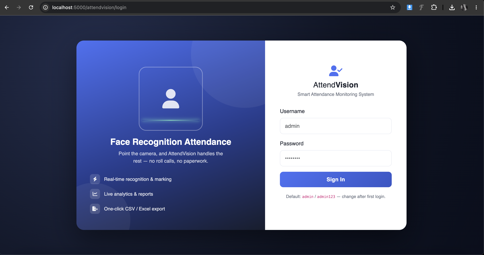
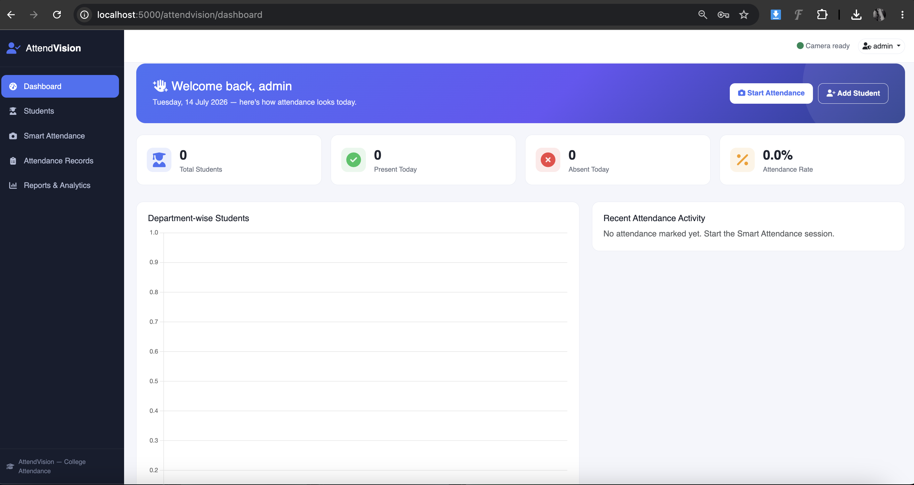
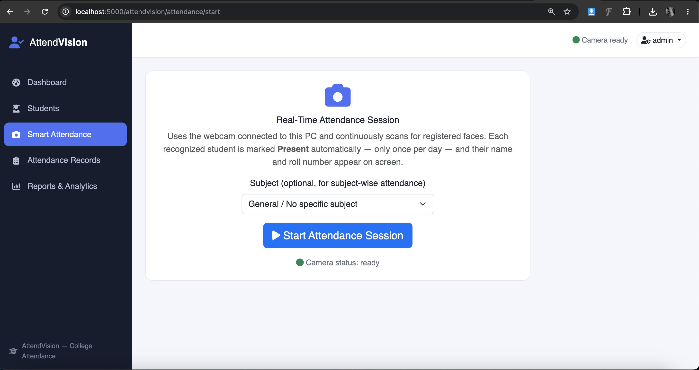
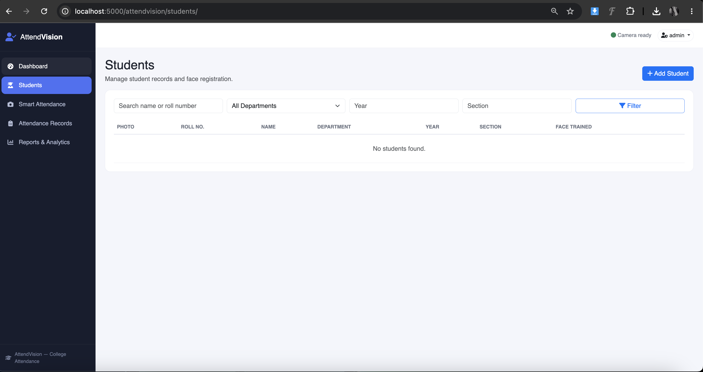
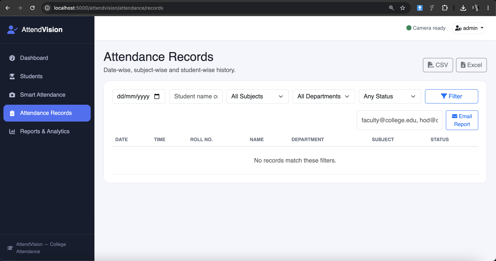
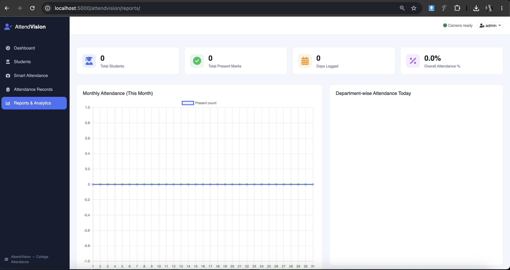

# AttendVision — Smart Attendance Monitoring System (AI Face Recognition)

A complete, self-contained Flask application for colleges to automatically track student
attendance using real-time face recognition from a classroom webcam.

## Highlights

- Secure admin/faculty login (Flask-Login)
- Student CRUD with photo, department, year, section
- Webcam-based face registration (~30 samples per student) with encoding training
  (`face_recognition` / dlib, 128-d encodings stored per student)
- Real-time attendance: opens the webcam, recognizes registered students, marks them
  **Present** automatically — once per day — with on-screen name + roll number overlay,
  and CLAHE-based low-light enhancement for dim classrooms
- Attendance records with date/subject/student/department/status filters
- Reports & analytics: totals, attendance %, monthly trend chart, department breakdown
  (Chart.js), all backed by real JSON API endpoints
- CSV / Excel export of any filtered record set
- Email attendance reports to faculty (Flask-Mail, Excel attachment)
- Bootstrap 5 responsive dashboard with sidebar navigation
- SQLite by default; MySQL supported via a single `DATABASE_URL` change

## Screenshots

| Login | Dashboard | Smart Attendance |
| --- | --- | --- |
|  |  |  |

| Students | Attendance Records | Reports |
| --- | --- | --- |
|  |  |  |

## Project Structure

```
smart-attendance-system/
├── app/
│   ├── __init__.py            # App factory, blueprint + extension registration, admin bootstrap
│   ├── extensions.py          # db, login_manager, mail singletons
│   ├── models.py              # Admin, Student, Subject, Attendance (SQLAlchemy)
│   ├── routes/
│   │   ├── auth.py            # /login /logout
│   │   ├── dashboard.py       # / (stats overview)
│   │   ├── students.py        # /students CRUD
│   │   ├── face.py            # /students/<id>/register-face, /attendance/start (camera)
│   │   ├── attendance.py      # /attendance/records, /attendance/export/<fmt>
│   │   └── reports.py         # /reports, JSON chart APIs, /reports/email
│   ├── services/
│   │   ├── face_service.py    # OpenCV + face_recognition: capture, train, recognize
│   │   ├── export_service.py  # CSV / Excel builders (pandas)
│   │   └── email_service.py   # Flask-Mail report sender
│   ├── templates/              # Jinja2 + Bootstrap 5 pages
│   └── static/                 # css/js/uploaded student photos
├── database/schema.sql         # Reference SQL schema (for MySQL / documentation)
├── docs/
│   ├── INSTALLATION.md
│   └── DEPLOYMENT.md
├── config.py                   # Env-driven configuration
├── run.py                       # Entry point
├── seed_data.py                 # Sample admin/subjects/students/attendance
├── requirements.txt
└── .env.example
```

## Quick Start

See `docs/INSTALLATION.md` for full setup. Short version:

```bash
cd smart-attendance-system
python -m venv venv && source venv/bin/activate   # Windows: venv\Scripts\activate
pip install -r requirements.txt
cp .env.example .env
python seed_data.py     # optional sample data
python run.py
```

Visit `http://localhost:5000`, log in with the admin credentials from `.env`
(default `admin` / `admin123` — change immediately).

## Important Hardware Note

Face registration and real-time attendance use OpenCV to access the **physical webcam of the
machine running the Flask server**. Run this app directly on the classroom/lab PC connected to
the camera — see `docs/DEPLOYMENT.md` for network/multi-room setups and the tradeoffs of a
browser-based camera alternative.

## Database Schema

**students**: id, name, roll_number, department, year, section, photo_path, face_encoding (pickled encodings), is_face_trained, created_at

**attendance**: id, student_id (FK), subject_id (FK, nullable), date, time, status, created_at
— unique on (student_id, date, subject_id) to guarantee "once per day" marking.

**subjects**: id, name, code — enables subject-wise attendance.

**admins**: id, username, email, password_hash, role.

Full reference SQL in `database/schema.sql`.

## Extending

- Add face model tuning via `FACE_MATCH_TOLERANCE` in `.env` (lower = stricter matching).
- Swap SQLite → MySQL by changing `DATABASE_URL` only; no code changes needed.
- Add more report breakdowns by adding routes in `app/routes/reports.py` (`/reports/api/...`)
  and consuming them from `app/templates/reports/reports.html` with Chart.js.
